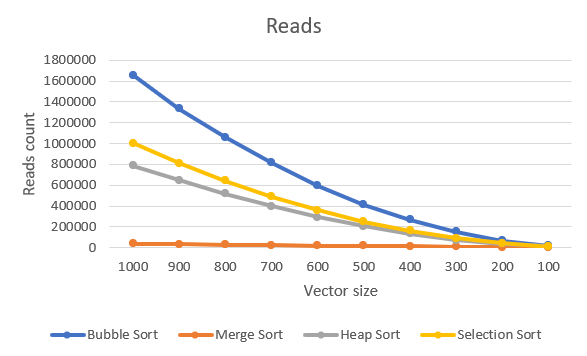
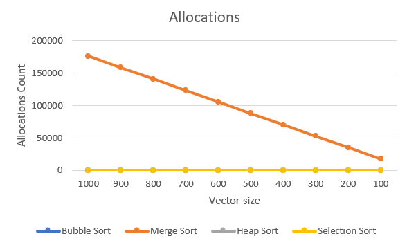

# Project 4 Report

Answer the following prompts directly in this file:
* Information about your dataset (you will be assigned a different grader for this project).

    My dataset contains 9 different attributes:
    - pokemon_id(int) -> Number from 1 to 1025 that identifies the Pokémon.
    - Name(string) -> Name of the Pokémon, unique attribute.
    - Primary_type(string) -> Pokémon's primary type.
    - Secondary_type(string) -> Pokémon's secondary type, can be empty.
    - First_appreance(string) -> Season of the show where the Pokémon had it's first appereance
    - Generation(string) -> Pokémon's generation.
    - Attack(int) -> Pokémon's attack value.
    - Defense(int) -> Pokémon's defense value.
    - Speed(int) -> Pokémon's speed value.
  

* Analyze the data. Graph the number of reads and allocations for each sorting algorithm and look at how the number of reads and allocations grows when the size of the data set grows. Compare and contrast the different sorting algorithms and draw conclusions about which sorting algorithms are more efficient. Discuss complexities and their effects.
  
  
    

    According to the reads graph, Bubble Sort and Selection Sort are the two algorithms with the highest number of reads, while Merge Sort and Heap Sort have significantly
    fewer reads. This is directly related to the time complexity of each algorithm.
    In the case of Bubble Sort and Selection Sort, both have a time complexity of O(N^2) (exponential increase on the graph), making them inefficient for large datasets. On the other hand, Heap Sort and Merge
    Sort both have a time complexity of O(NlogN). However, despite having the same complexity, there is a clear difference in the number of reads between Heap Sort and Merge Sort, which is due to the way they
    work internally. Merge Sort accesses elements in a more structured and sequential way, reducing the number of reads, whereas Heap Sort involves multiple swaps and comparisons, leading to numerous accesses
    to the elements.

  

    
    According to the allocations graph, Merge Sort is the algorithm that requires the most memory allocation. This is because its auxiliary complexity is O(N), meaning that the algorithm requires additional 
    memory proportional to the input size. As a result, we observe a linear increase in memory allocation as the vector size grows. 
    In contrast, Bubble Sort, Heap Sort, and Selection Sort have a much lower number of allocations, which remains constant across different vector sizes, since they all have constant auxiliary complexity O(1).

    Base on the properties of each algorithm, I came with the conclusion that Merge Sort is the fastest algorithm and Bubble Sort the most memory efficent. However, they both would not be ideal on certain
    environments, such as memory-constrained or speed-constrained environments. Therefore, Heap Sort seems to be the most efficient one since it is able to balance speed and memory efficiency.

Look at the output from the stabilityTest function and answer the following questions:
  * How are the names sorted by default?
  

    By default, the names are sorted alphabetically by first name.
  * How is the output from the two stable sorting algorithms different from the two unstable ones? Be specific in your answer, and use what you know about how each sorting algorithm works to justify your observations.
    

    For this analysis, it is important to note that all the algorithms are sorting based on the last name and that there are multiple repetitions of last names in the list.
    In all cases, the final result is a list sorted alphabetically by last name. However, the key difference between the stable algorithms (Bubble Sort and Merge Sort) and
    the unstable ones (Heap Sort and Selection Sort) lies in how they handle elements with the same last name.
    Stable sorting algorithms preserve the original order of elements that have the same sorting key, while unstable algorithms do not guarantee this order. Since the original
    list was already sorted alphabetically by first name, the final outcome for stable algorithms is a list sorted alphabetically by last name, with elements that share the same
    last name also maintaining their original first-name alphabetical order.

  * Answers to the following questions: 
  * If you need to sort a contacts list on a mobile app, which sorting algorithm(s) would you use and why? 

    When dealing with a contacts list in a mobile app, two essential properties are required: speed and low storage usage. According to the results obtained, Bubble Sort has the
    lowest number of allocations compared to the other algorithms. However, it also has the highest number of reads, making it inefficient in this situation, and the same applies
    to the Selection Sort algorithm.
    The remaining two options are Heap Sort and Merge Sort. Although Merge Sort is the fastest, its speed does not compensate for the large amount of allocated memory. Therefore,
    Heap Sort would be the ideal algorithm in this case, as it efficiently handles the dataset while optimizing memory usage. Additionally, its memory usage remains constant and
    does not increase with the number of sorted elements.

  * What about if you need to sort a database of 20 million client files that are stored in a datacenter in the cloud?
    
    
    In this situation, since we are dealing with a very large dataset stored in a datacenter in the cloud, speed would be prioritized over memory usage, as the cloud has sufficient
    storage to handle large memory allocations. Because of this, Merge Sort would be the ideal algorithm, as it is the fastest among all the tested options.