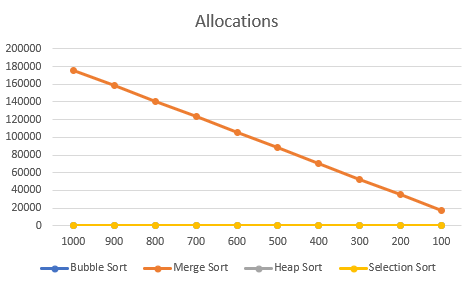

# Project 4 Report

Answer the following prompts directly in this file:
* Information about your dataset (you will be assigned a different grader for this project).

  My dataset contains 9 different attributes:
  - pokemon_id(int) -> Number from 1 to 1025 that identifies the Pokémon.
  - Name(string) -> Name of the Pokémon, unique attribute.
  - Primary_type(string) -> Pokémon's primary type.
  - Secondary_type(string) -> Pokémon's secondary type, can be empty.
  - First_appreance(string) -> Season of the show where the Pokémon had it's first appereance
  - Generation(string) -> Pokémon's generation.
  - Attack(int) -> Pokémon's attack value.
  - Defense(int) -> Pokémon's defense value.
  - Speed(int) -> Pokémon's speed value.
  

* Analyze the data. Graph the number of reads and allocations for each sorting algorithm and look at how the number of reads and allocations grows when the size of the data set grows. Compare and contrast the different sorting algorithms and draw conclusions about which sorting algorithms are more efficient. Discuss complexities and their effects.
  
  
  

* Look at the output from the stabilityTest function and answer the following questions:
  * How are the names sorted by default?
  * How is the output from the two stable sorting algorithms different from the two unstable ones? Be specific in your answer, and use what you know about how each sorting algorithm works to justify your observations.
* Answers to the following questions: 
  * If you need to sort a contacts list on a mobile app, which sorting algorithm(s) would you use and why? 
  * What about if you need to sort a database of 20 million client files that are stored in a datacenter in the cloud?
